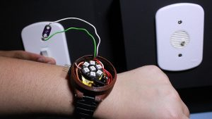

# README

## English 

Front-end files repository of the Computer Engineering course conclusion project.

Code developed by Gabriel de Carvalho Souza

October 2017

### Project Description ###

The project was idealized from the idea to assist the hearing impaired in their common daily routine, giving a simple way to know if someone is ringing the bell from any place in their house. So the idea was to develop a prototype of a watchband and a small module that can be attached to the house bell system, so the person can be notified by vibrations and lights that the bell ringed.

## Português

Repositório dos arquivos do projeto de iniciação cientifica do curso Engenharia da Computação.

Código desenvolvido por Gabriel de Carvalho Souza

Outubro 2017

### Descrição do Projeto ###

O projeto foi idealizado a partir da ideia de auxilio à deficientes auditivos no dia a dia comum, trazendo uma forma simples de se saber em qualquer ambiente da casa se a campainha foi tocada. Com isso foi desenvolvido um prototipo de pulseira e um modulo que se encaixa a campainha convencional da casa para que a pessoa seja notificada de forma simples por meio de vibrações na pulseira e luzes que a campainha foi tocada.

